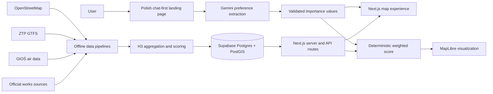

<div align="center">

# 🔎 Citylens

### Find the part of Kraków that fits your life.

An explainable, personalized city-discovery experience built for the **HackYeah 2026 edition**.
Describe what matters to you, explore a data-backed suitability map, compare areas, and understand why each place matches your priorities.

[](https://github.com/thatsfov1/citylens/stargazers)
[](https://hackyeah.pl/)

[](https://nextjs.org/)
[](https://react.dev/)
[](https://www.typescriptlang.org/)
[](https://maplibre.org/)
[](https://h3geo.org/)
[](https://supabase.com/)
[](https://ai.google.dev/)
[](https://www.openstreetmap.org/)

**Created by [Yevhenii Kulikovskyi](https://github.com/thatsfov1) and [Daniel Skwarczek](https://github.com/dan-skw).**

[View the pitch deck](presentation/citylens-pitch.pdf)

</div>

---

## About the project

Citylens helps people understand which parts of Kraków match their lifestyle, needs, and practical constraints.

Instead of publishing a generic list of the city's “best” neighborhoods, Citylens asks what matters to a specific person and calculates a personalized match from real geographic data. The user can describe their needs in natural language or adjust them manually, then explore the result on an interactive H3 map.

The application is designed around a strict separation of responsibilities:

- **Gemini interprets language into structured preferences.**
- **Deterministic scoring calculates geographic suitability.**
- **Stored indicators explain every score using source data.**

The language model never invents neighborhood facts, chooses the “best” district, or computes map scores.

## What you can do

- **Describe your ideal area naturally** — tell the assistant about parks, sport, culture, shopping, transport, education, budget, commute, or family needs.
- **Explore a personalized Kraków map** — see a smooth suitability layer across approximately 460 H3 cells.
- **Switch map perspectives instantly** — inspect your personal match or individual categories: sport, culture, greenery, shopping, transport, and education.
- **Understand every result** — open an area to see category scores, nearby places, source-backed indicators, strengths, and trade-offs.
- **Inspect real places** — display relevant POIs, green areas, transit stops, schools, cultural venues, and other contributors directly on the map.
- **Compare areas** — place up to three locations side by side and see which weighted categories create the difference.
- **Set practical filters** — narrow results by rent budget, commute time, proximity to a named place, education stage, or minimum safety-indicator level.
- **Check what is changing** — view ongoing and planned construction works with timing, distance, and official source links.
- **Review environmental context** — inspect live-or-snapshot air-quality estimates and transparent safety-environment indicators.
- **Check everyday services** — see a separate information layer for pharmacies, doctors, hospitals, post offices, and banks.
- **Plan around a car** — show nearby parking, P+R locations, parking meters, and clear data limitations.
- **Save and share a map** — preserve preferences, filters, selected areas, and comparisons in a URL or browser-local saved map.
- **Keep using the app when optional services fail** — deterministic mock data and manual preference controls keep the core demo functional.

## Why Citylens is different

### Personal fit, not an objective ranking

A lower score does not mean that an area is bad. It means that the area is a weaker match for the current user's stated priorities.

### Explainability by design

Every result follows a visible chain:

```text
Personal match
  ↓
Weighted category scores
  ↓
Measured indicators
  ↓
Named source datasets
```

Examples include green-area coverage, distance to a park, nearby sports facilities, weekday public-transport frequency, education access, and the real places contributing to a score.

### Reliable hackathon demo

Expensive geographic processing happens offline. Runtime requests use precomputed scores, while local deterministic fallbacks keep the application usable if Supabase, Gemini, routing, or another external service is unavailable.

## Core categories

| Category | What it represents |
| --- | --- |
| Sport | Sports centres, pitches, pools, stadiums, fitness facilities, and related places |
| Culture | Museums, theatres, cinemas, galleries, libraries, attractions, and selected historic places |
| Greenery | Green-area coverage and proximity to meaningful parks, forests, gardens, and reserves |
| Shopping | Supermarkets, convenience stores, malls, and other mapped retail |
| Transport | Official weekday public-transport service frequency plus rail access |
| Education | Access to kindergartens, primary schools, secondary schools, and universities |

The personalized score is a deterministic weighted sum:

```text
personalScore =
  sportScore × sportWeight +
  cultureScore × cultureWeight +
  greeneryScore × greeneryWeight +
  shoppingScore × shoppingWeight +
  transportScore × transportWeight +
  educationScore × educationWeight
```

Safety, air quality, health services, rent, proximity, commute, parking, and construction works do **not** secretly alter this score. They are displayed as separate filters or contextual information.

## Architecture



### Runtime flow

1. The user describes their priorities or chooses a suggestion.
2. `POST /api/chat` validates Gemini's structured response with Zod.
3. Importance values are converted into deterministic category weights.
4. The map loads precomputed H3 category scores from Supabase.
5. Personal scores are calculated client-side.
6. MapLibre renders the suitability surface, places, filters, routes, works, and selected-area details.
7. If Supabase is unavailable, the app falls back to deterministic mock cells.

### Data-processing flow

1. Source datasets are downloaded or refreshed outside the request path.
2. Features are normalized and assigned distance-weighted influence.
3. Kraków is divided into H3 resolution 8 cells.
4. Category scores and explainability indicators are calculated.
5. Seed SQL is generated and loaded into Supabase/PostGIS.
6. Runtime requests read the prepared results instead of querying Overpass or recomputing geometry.

## Data sources

| Source | Used for |
| --- | --- |
| [OpenStreetMap](https://www.openstreetmap.org/copyright) | POIs, green areas, districts, rail access, lighting, CCTV, emergency services, parking |
| ZTP Kraków GTFS | Weekday bus and tram service frequency and selected transit itineraries |
| [GIOŚ](https://powietrze.gios.gov.pl/) | Recent PM10 and PM2.5 station readings |
| ZDMK and Kraków municipal sources | Ongoing and planned road or infrastructure works |
| MSIP Kraków | Investment-related permits and parking-meter snapshot |
| Otodom | One-off district-level rental asking-price snapshot |
| OSRM public routing service | Best-effort walking, cycling, and driving travel times and routes |

Source dates, licenses, links, and caveats are centralized in `src/lib/sources.ts` and surfaced in the interface.

## Engineering highlights

- **Data-backed spatial scoring** using H3, geospatial distance bands, percentile normalization, and precomputed indicators.
- **Smooth MapLibre heat field** clipped to Kraków's boundary while retaining H3 cells as interaction targets.
- **PostGIS-backed details** for cell indicators, nearest places, green polygons, and nearby construction works.
- **Narrow, validated AI role** using Gemini and Zod, with manual controls as a fallback.
- **Official GTFS integration** for service-frequency scoring and selected-area transit planning.
- **Live air with a safe fallback** using the latest valid GIOŚ readings when available and a committed snapshot otherwise.
- **Everyday-services context** calculated separately from the personal match so access to essential places stays transparent.
- **Deterministic explanations** generated from stored facts rather than free-form LLM claims.
- **Shareable state** encoded in the URL, including weights, filters, selected cells, comparisons, and map mode.
- **Client and server caching** for per-cell detail, place, and works responses.
- **Responsive Polish UI** with keyboard-friendly controls, reduced-motion behavior, and a mobile-capable map experience.
- **Automated evidence checks** for curated construction records before they enter generated seed data.
- **148 unit tests** covering scoring, explanations, filters, routing parsers, map logic, source metadata, and data verification.

## Tech stack

| Area | Technology |
| --- | --- |
| Application | Next.js 16 App Router, React 19, TypeScript |
| Styling | Tailwind CSS 4, shadcn/ui, Base UI, Motion |
| Mapping | MapLibre GL JS, H3 |
| Validation | Zod |
| AI | Google Gemini server-side API |
| Database | Supabase Postgres, PostGIS |
| Data processing | TypeScript scripts executed with `tsx` |
| Geographic data | OpenStreetMap and Overpass |
| Transit | Official ZTP Kraków GTFS feeds |
| Testing | Node.js test runner, TypeScript via `tsx` |
| Tooling | ESLint, npm, Supabase CLI |

## Repository structure

```text
citylens/
├── src/
│   ├── app/
│   │   ├── api/                 # Chat, hex, place, works, and commute endpoints
│   │   ├── map/                 # Server-rendered map entry point
│   │   └── page.tsx             # Landing page
│   ├── components/
│   │   ├── landing/             # Video hero, chat, suggestions, and use-case callouts
│   │   ├── map/                 # Map, panels, filters, timeline, compare, and sharing UI
│   │   └── ui/                  # Shared UI primitives
│   ├── lib/
│   │   ├── data/                # Parsers, source snapshots, routing, and domain data
│   │   ├── h3/                  # Kraków grid, mask, and boundary
│   │   ├── llm/                 # Gemini integration and validated chat schema
│   │   ├── map/                 # Heat field, layers, icons, places, and map key
│   │   ├── mock-data/           # Deterministic offline fallback
│   │   ├── scoring/             # Personal score, filters, facts, compare, and sensitivity
│   │   ├── share/               # URL state and browser-local saved maps
│   │   └── supabase/            # Server and browser data clients
│   └── types/                   # Shared frontend/backend contracts
├── scripts/
│   ├── air/                     # GIOŚ snapshot and air-score generation
│   ├── gtfs/                    # Transit frequency and timetable builds
│   ├── health/                  # Everyday-services snapshot and score generation
│   ├── osm/                     # OSM download, scoring, sampling, and place export
│   ├── parking/                 # Parking snapshot build
│   ├── rent/                    # Rental snapshot aggregation
│   ├── sanity/                  # Known-place checks for generated scores
│   ├── safety/                  # Lighting and safety-context builds
│   └── works/                   # Official-source snapshots, permits, and evidence checks
├── supabase/
│   ├── migrations/              # PostGIS schema, RLS, functions, and category additions
│   ├── seed.sql                 # Reproducible H3 score seed
│   └── seed-places.sql          # Small development place seed
├── data/                        # Committed source snapshots and small development samples
├── presentation/                # Hackathon pitch deck and supporting assets
└── docs/PROJECT_DECISIONS.md    # Current architecture and implementation decisions
```

## Getting started

### Prerequisites

- [Node.js](https://nodejs.org/) 20.9 or newer; Node.js 22 is recommended
- npm
- Optional: [Supabase CLI](https://supabase.com/docs/guides/cli) for a local or linked database
- Optional: a Google Gemini API key for natural-language preference extraction

### 1. Clone the repository

```bash
git clone https://github.com/thatsfov1/citylens.git
cd citylens
```

### 2. Install dependencies

```bash
npm install
```

The install step also copies the MapLibre worker required by the application.

### 3. Configure the environment

```bash
cp .example.env .env.local
```

Fill in the values you want to use:

```env
NEXT_PUBLIC_SUPABASE_URL=
NEXT_PUBLIC_SUPABASE_PUBLISHABLE_KEY=
GEMINI_API_KEY=
# GEMINI_MODEL=gemini-flash-latest
```

- Supabase values enable the real Kraków dataset.
- `GEMINI_API_KEY` enables natural-language preference extraction.
- Without Supabase, the map uses deterministic mock scores.
- Without Gemini, the application remains usable through manual preference controls.
- Secrets must never be exposed through `NEXT_PUBLIC_*` variables.

### 4. Start the development server

```bash
npm run dev
```

Open [http://localhost:3000](http://localhost:3000).

## Supabase setup

The database uses Postgres, PostGIS, row-level security, and read-only public policies for the datasets required by the app.

For a local Supabase environment:

```bash
npx supabase start
npx supabase db reset
```

This applies the migrations in `supabase/migrations/` and loads the configured seed.

The central tables are:

- `hex_scores` — geometry, category scores, district, explainability indicators, safety, air, health, and education-stage scores.
- `pois` — normalized point features used for map pins and nearby-place details.
- `green_areas` — simplified green-space polygons.
- `works` — ongoing works, planned projects, and investment-related permits with source metadata.

Apply migrations before deploying code that selects newly added columns. The application intentionally falls back to mock data when a required production schema change is missing.

## API routes

| Method and route | Responsibility |
| --- | --- |
| `GET /api/hexes` | Returns the Kraków H3 score dataset |
| `GET /api/hexes/[h3Index]` | Returns indicators and details for one cell |
| `GET /api/hexes/[h3Index]/places` | Returns nearby contributing places and green areas |
| `GET /api/hexes/[h3Index]/works` | Returns nearby ongoing and planned works |
| `GET /api/air` | Returns recent GIOŚ air data with the committed snapshot as fallback |
| `GET /api/works` | Returns work geometries used by the timeline/map layer |
| `POST /api/chat` | Converts a Polish conversation into validated preferences and optional filters |
| `POST /api/commute` | Calculates or estimates travel times for map cells |
| `POST /api/commute/route-line` | Returns a selected-area route or transit itinerary |

## Available commands

| Command | Description |
| --- | --- |
| `npm run dev` | Start the Next.js development server |
| `npm run build` | Create and validate a production build |
| `npm run start` | Start the production server |
| `npm run lint` | Run ESLint |
| `npm test` | Run the TypeScript unit-test suite |

### Demo easter egg

Sending `isgudokei` in the landing chat returns the sourced standing lunch offer for W Starej Kuchni without calling Gemini. The response intentionally does not invent the restaurant's changing daily dishes.

## Rebuilding geographic data

The running app never queries Overpass directly. Full extracts are downloaded and processed offline.

### OpenStreetMap and H3 scores

```bash
# Download full extracts into the gitignored directory
OSM_DIR=data/osm/full npx tsx scripts/osm/fetch.ts

# Build scores and write supabase/seed.sql
OSM_DIR=data/osm/full npx tsx scripts/osm/compute.ts

# Export full place and green-area seed data
OSM_DIR=data/osm/full npx tsx scripts/osm/export-places.ts

# Refresh only the small committed development sample
npx tsx scripts/osm/sample.ts
```

`data/osm/*.json` is intentionally a small deterministic sample. Do not use it to generate production Kraków scores. Real score generation requires `data/osm/full/`.

### Public transport

```bash
npx tsx scripts/gtfs/build.ts
npx tsx scripts/gtfs/build-timetable.ts
```

The first command refreshes service-frequency data. The second builds the compact timetable used for selected-area transit itineraries.

### Air quality

```bash
npx tsx scripts/air/build-air.ts
npx tsx scripts/air/compute.ts
```

### Safety context

```bash
npx tsx scripts/safety/build-lighting.ts
npx tsx scripts/safety/build-features.ts
```

### Health and everyday services

```bash
npx tsx scripts/health/build-features.ts
npx tsx scripts/health/compute.ts
```

The generated health layer is informational. It compares mapped access to pharmacies, doctors and clinics, hospitals, post offices, and banks; it does not evaluate service quality, availability, or waiting times.

### Construction and planned works

```bash
npx tsx scripts/works/snapshot.ts
npx tsx scripts/works/fetch-msip.ts
npx tsx scripts/works/build.ts
```

The works build fails when curated claims cannot be verified against saved official-source evidence.

### Parking and rent snapshots

```bash
npx tsx scripts/parking/build.ts
npx tsx scripts/rent/build.ts
```

These scripts access external services and should be run deliberately. Existing committed snapshots keep the demo reproducible.

## Quality checks

Before merging a change:

```bash
npm run lint
npm test
npm run build

# Validate the committed score seed against known Kraków places
npx tsx scripts/sanity/report.ts
```

The unit-test suite covers deterministic scoring, category explanations, safety, air and health calculations, rent filtering, commute parsing, sharing, comparison, source metadata, works verification, sanity checks, and map-layer behavior.

## Reliability and privacy

- No user account or authentication is required.
- Saved maps stay in the current browser's `localStorage`.
- Shareable state is encoded in the URL.
- Gemini keys and elevated Supabase credentials remain server-side.
- The app has no runtime dependency on live OpenStreetMap queries.
- Failed optional integrations degrade to estimates, hidden sections, manual controls, or deterministic mock data.
- Geographic scores are never generated by the LLM.

## Known limitations

- Kraków is the only supported city.
- OpenStreetMap completeness varies by category and district.
- Culture remains less densely mapped than transport or shopping.
- Safety values describe environmental proxies such as mapped lighting, cameras, and nearby help—not crime risk.
- Air quality is interpolated from a small station network; live readings fall back to a committed snapshot and are not an annual or street-level measurement.
- Health indicators count mapped nearby services but do not describe quality, opening hours, queues, NFZ contracts, or capacity.
- Rental data contains asking prices from a dated marketplace snapshot and is aggregated at district level.
- Parking data cannot guarantee a free space, current tariff, or resident eligibility.
- Construction information is informational and never changes an area's match score.
- Public routing services are best-effort; transit-wide filtering uses a deterministic estimate.
- Saved maps are local to one browser, and there is no account synchronization.

## Project status

Citylens is a working hackathon MVP with a complete personalized-discovery loop:

```text
Landing chat
  ↓
Validated preferences
  ↓
Personalized Kraków map
  ↓
Category exploration
  ↓
Area details and real places
  ↓
Filters, comparison, timeline, saving, and sharing
```

The current focus is demo reliability, explainability, and strong visual communication rather than production-scale multi-city support.

## Attribution

OpenStreetMap-derived data is © [OpenStreetMap contributors](https://www.openstreetmap.org/copyright) and available under the [Open Database License](https://opendatacommons.org/licenses/odbl/).

Additional datasets remain subject to their respective providers' terms. Citylens displays source links and caveats wherever those datasets affect the user experience.

---

<div align="center">

Built for **HackYeah 2026** in Kraków.

**Yevhenii Kulikovskyi · Daniel Skwarczek**

[View source](https://github.com/thatsfov1/citylens) · [Open the pitch deck](presentation/citylens-pitch.pdf)

</div>
